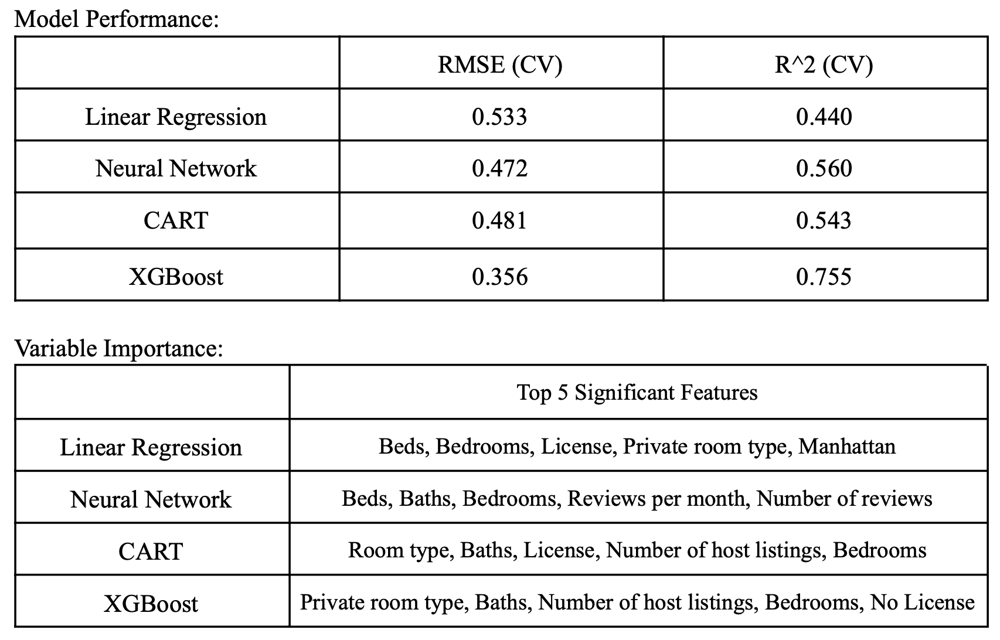
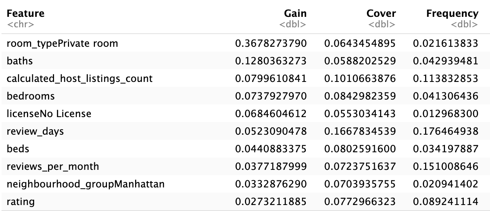
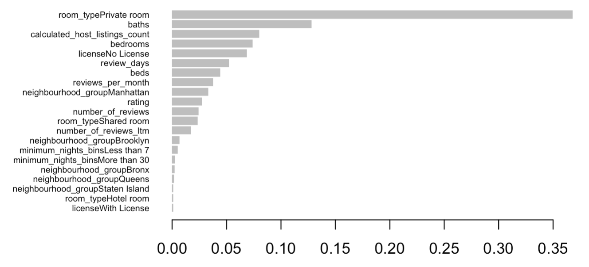

# Airbnb Price Prediction with Supervised Models

This is a Predictive Analytics project which predicted Airbnb prices (data from Kaggle) using multiple models, justifying price variations based on feature importance with a strong R² value.

## Table of Contents
- [Project Description](#project-description)
- [Dataset Overview](#dataset-overview)
- [Analysis Components and Results](#analysis-components-and-results)
- [Contributors](#contributors)

## Project Description
Airbnb, Inc. is an American San Francisco-based company, which was founded in 2008. Airbnb, originally known as AirBedandBreakfast.com, operates an online marketplace for short-term and long-term home stays and experiences. This platform has not only revolutionized travel accommodations but has also shaped the way people connect and experience new destinations. In the dynamic landscape of the rental market, pricing plays a pivotal role in the success of Airbnb listings. Multiple factors need to be considered in this process, including location, size, rating, etc. The complexity of this process poses significant challenges for hosts to decide the price for their listings.

In this research, we employed multiple supervised learning methods to predict the prices of Airbnb accommodations, such as Linear Regression, Neural Network, Tree, and XGBoost. By harnessing the power of data-driven insights, we aim to develop a nuanced understanding of the factors influencing pricing strategies within the Airbnb ecosystem and therefore offer more guidance to Airbnb hosts and users.

## [Dataset Overview](https://www.kaggle.com/datasets/vrindakallu/new-york-dataset?resource=download)
This dataset from Kaggle describes the latest listing activity in New York City, New York as of January 5th, 2024. The raw dataset comprised 22 columns and 20,758 rows, with each row corresponding to an individual Airbnb listing. A thorough inspection revealed no missing values, indicating a well-maintained dataset, albeit with potential for optimization to better suit our analysis goals.

## Analysis Components and Results
1. [Python](eda.ipynb)
- Data Cleaning and Preprocessing 
- Exploratory Data Analysis
- Feature Engineering
2. R
- Modeling
    - Linear Regression
    - [Neural Network](Project_NN.Rmd)
    - Classification and Regression Tree (CART)
    - [XGBoost](Project_XGBoost.Rmd)

See more details in the [report](Airbnb_Report.pdf).

## Contributors
- Zhiwei (Alina) Gu
- Xiyi Lin
- Yi (Grace) Xie
- Judy (Zhiyi) Zhu
